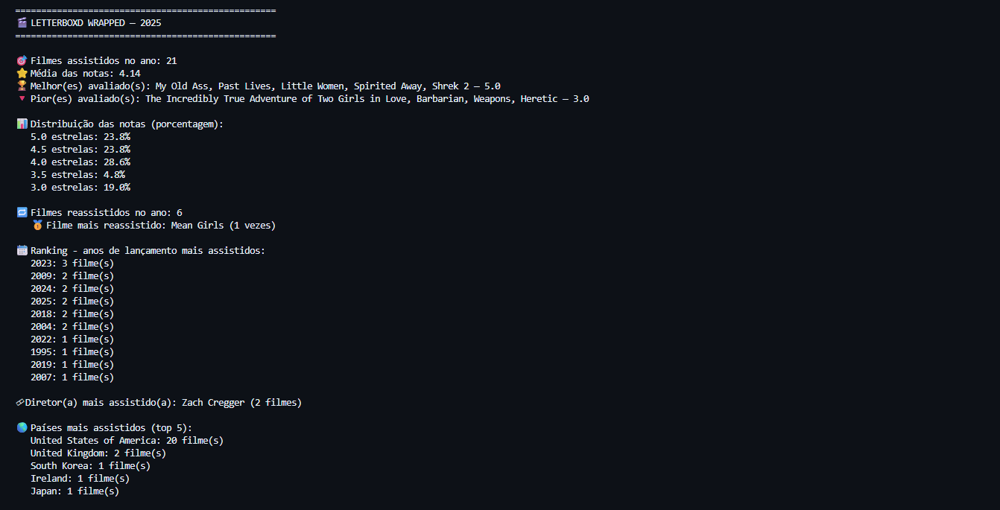

# Letterboxd Wrapped



> Análise anual dos seus filmes assistidos no Letterboxd

Este projeto foi criado com o objetivo de praticar Python, Pandas e consumo de APIs, gerando um relatório estilo "Spotify Wrapped" a partir do arquivo `diary.csv` exportado do Letterboxd.

---

## Funcionalidades

* Total de filmes assistidos no ano
* Média das notas
* Gênero mais assistido
* Filme mais assistido
* Melhor e pior filme avaliados
* Quantidade de reassistidos
* Distribuição das notas (percentuais)
* Diretor(a) mais assistido(a)
* Anos de lançamento mais assistidos
* País dos filmes vistos (via API)
* Tempo total assistindo filmes
* “Você em 3 filmes” — seleção personalizada

---

## Tecnologias utilizadas

* Python
* Pandas
* Requests
* API do TMDb

## Guia de Uso

### Exportando seus dados do Letterboxd

Para usar o projeto, você precisa exportar seus dados. Para isso, acesse: [:link:https://letterboxd.com/settings/data/](https://letterboxd.com/settings/data/)

Em seguida:

1. Faça download do arquivo `.zip`
2. Extraia o arquivo **`diary.csv`**
3. Coloque o `diary.csv` na pasta do projeto (mesmo diretório de `wrapped.py`)

### Configurando sua chave da API do TMDb

Algumas funcionalidades usam dados externos (gênero, diretor, país, duração do filme). Para isso, é necessário criar uma chave de API no TMDb:

1. Crie uma conta em [:link:https://www.themoviedb.org/](https://www.themoviedb.org/)
2. Acesse *Configurações → API*
3. Gere sua **API Key**
4. Insira a chave no arquivo `wrapped.py`:

```python
TMDB_API_KEY = "SUA_CHAVE_AQUI"
```

### Executando o script

No terminal, use:

```bash
python wrapped.py --year [ANO]
```

Exemplo:

```bash
python wrapped.py --year 2025
```